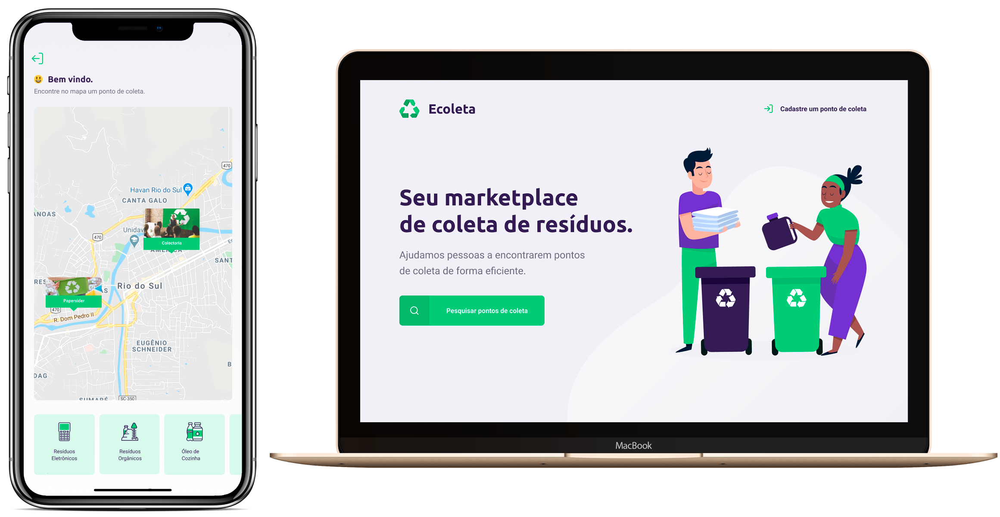

<h1 align="center">
  
</h1>

<h4 align="center">🚀 Next Level Week #1</h4>

  

  

  

  

  

  <a href="#rocket-tecnologias">Tecnologias</a>&nbsp;&nbsp;&nbsp;|&nbsp;&nbsp;&nbsp;
  <a href="#computer-projeto">Projeto</a>&nbsp;&nbsp;&nbsp;|&nbsp;&nbsp;&nbsp;
  <a href="#fire-como-iniciar-a-aplicação">Como iniciar a aplicação</a>&nbsp;&nbsp;&nbsp;|&nbsp;&nbsp;&nbsp;
  <a href="#thinking-como-contribuir">Como contribuir</a>&nbsp;&nbsp;&nbsp;|&nbsp;&nbsp;&nbsp;
  <a href="#memo-licença">Licença</a>

  

## :rocket: Tecnologias

Esse projeto foi desenvolvido com as seguintes tecnologias:

- [Yarn](https://yarnpkg.com/)
- [Node.js](https://nodejs.org/en/)
- [React](https://reactjs.org/)
- [React Native](https://facebook.github.io/react-native/)
- [Expo](https://expo.io/)

## :computer: Projeto

Ecoleta é uma aplicação que pode ser usado para gerenciamento de pontos de coletas de resíduos. A aplicação mobile pode ser usado pelos usuários que querem encontrarem pontos de coleta de forma eficiente e a versão web deve ser usada pelas empresas que queiram cadastrar novos pontos de coleta.

## :fire: Como iniciar a aplicação

Para rodar essa aplicação, você precisa ter [Git](https://git-scm.com), [Node.js v10.16](https://nodejs.org/en/) ou superior + [Yarn v1.13](https://yarnpkg.com/) ou superior instalados no seu computador.

### No momento, você pode iniciar o projeto com as seguintes etapas:

1. Clone o repositório: `https://github.com/lucianotavernard/next-level-week-1`
2. Acesse o diretório do projeto: `cd next-level-week-1`
3. Rode o comando para instalar as dependências: `yarn`
4. Rode o comando para instalar as outras dependências: `yarn bootstrap`
5. Rode o comando para criar as migrations: `yarn db:migrate`
6. Rode o comando para inserir as migrations: `yarn db:seed`
7. Para iniciar toda a aplicação: `yarn dev`
8. Para iniciar somente o backend e o frontend: `yarn dev-web`
9. Para iniciar somente o backend e o mobile: `yarn dev-mobile`

## :thinking: Como contribuir

- Faça um fork desse repositório;
- Cria uma branch com a sua feature: `git checkout -b minha-feature`;
- Faça commit das suas alterações: `git commit -m 'feat: Minha nova feature'`;
- Faça push para a sua branch: `git push origin minha-feature`.

Depois que o merge da sua pull request for feito, você pode deletar a sua branch.

## :memo: Licença

Esse projeto está sob a licença MIT. Veja o arquivo [LICENSE](LICENSE.md) para mais detalhes.
